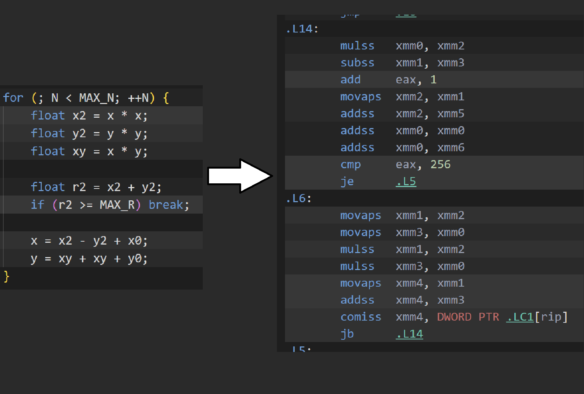
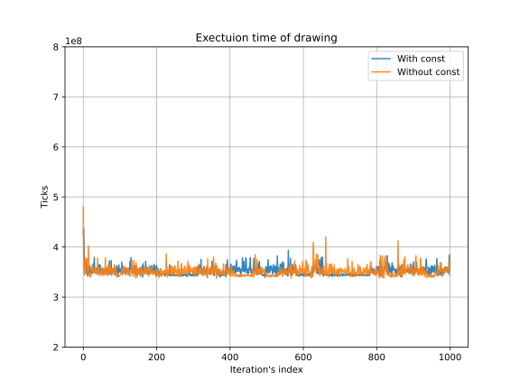
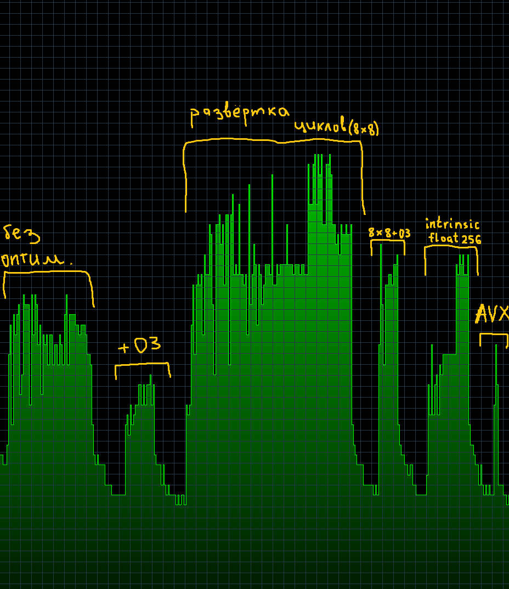
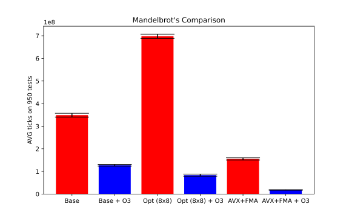
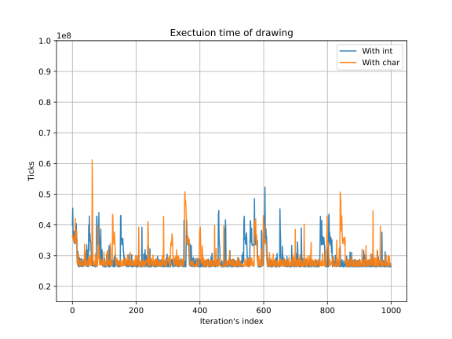
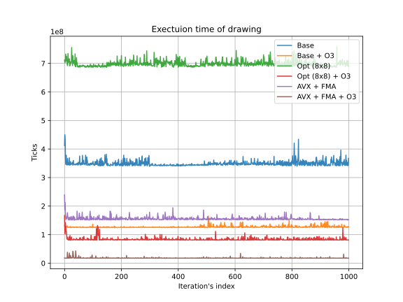
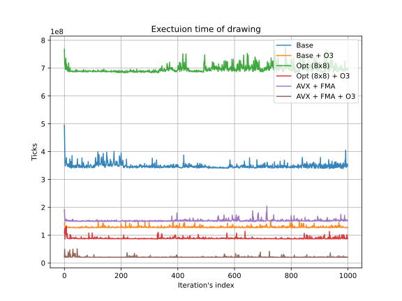
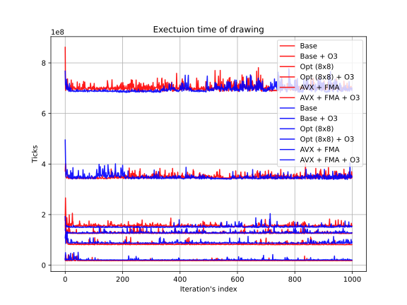

| **Mandelbrot**'**s** **type** | **Averages** | **Deviations** | **Minimums** | **Cycles per pixel** |
| ----------------------------- | ------------ | -------------- | ------------ | -------------------- |
| Base                          | 351,001,197  | 10,094,085     | 338,213,442  | 731.25               |
| Base + O3                     | 129,909,043  | 7,877,675      | 123,852,950  | 270.64               |
| Opt (8x8)                     | 707,617,959  | 15,818,411     | 683,133,938  | 1474.20              |
| Opt (8x8) + O3                | 84,092,695   | 5,782,438      | 80,329,954   | 175.19               |
| AVX+FMA                       | 159,328,902  | 7,484,441      | 151,068,478  | 331.94               |
| AVX+FMA + O3                  | 18,661,017   | 2,828,423      | 17,394,872   | 38.88                |


Ассемблерный вид первой версии (с godbolt)


Тот же код, но с -O3

Интересное явления, не замеченное ранее - чтобы сравнить с MAX_R, опять лезем в память, хотя сделав её не константой можем добиться того, чтобы она тоже легла в регистр, что в теории должно повысить производительность.


По результатам тестирования получаем такую картину:



В числовых данных отличия среднего количества тиков также не велико:
351240272
и
351087895

Аналогичной разницы не получилось и для версии с intrinsic-ами: 
18222836 
и 
18281953

Далее рассмотрим ассемблерную версию mand_8 (оптимизация 8x8)

Цикл по количество итераций до вылета точки:
```c++
for (; N < MAX_N; ++N) {
    float x2[SZ]; for (int k = 0; k < SZ; ++k) x2[k] = x[k] * x[k];
    float y2[SZ]; for (int k = 0; k < SZ; ++k) y2[k] = y[k] * y[k];
    float xy[SZ]; for (int k = 0; k < SZ; ++k) xy[k] = x[k] * y[k];

    int comp[SZ];
    for (int k = 0; k < SZ; ++k) comp[k] = ((x2[k] + y2[k]) < MAX_R);

    int mask = 0;
    for (int k = 0; k < SZ; ++k) mask += (comp[k] << k);

    if (!mask) break;

    for (int k = 0; k < SZ; ++k) cnt[k] += comp[k];

    for (int k = 0; k < SZ; ++k) if (comp[k]) x[k] = x2[k] - y2[k] + x0[k];
    for (int k = 0; k < SZ; ++k) if (comp[k]) y[k] = xy[k] + xy[k] + y0[k];
}
```

Превратился в:
```x86asm
.L43:
        mov     DWORD PTR [rsp+820], 0
        jmp     .L23
.L24:
        mov     eax, DWORD PTR [rsp+820]
        cdqe
        vmovss  xmm1, DWORD PTR [rsp+80+rax*4]
        mov     eax, DWORD PTR [rsp+820]
        cdqe
        vmovss  xmm0, DWORD PTR [rsp+80+rax*4]
        vmulss  xmm0, xmm1, xmm0
        mov     eax, DWORD PTR [rsp+820]
        cdqe
        vmovss  DWORD PTR [rsp+176+rax*4], xmm0
        add     DWORD PTR [rsp+820], 1
.L23:
        cmp     DWORD PTR [rsp+820], 7
        jle     .L24
        mov     DWORD PTR [rsp+816], 0
        jmp     .L25
.L26:
        mov     eax, DWORD PTR [rsp+816]
        cdqe
        vmovss  xmm1, DWORD PTR [rsp+112+rax*4]
        mov     eax, DWORD PTR [rsp+816]
        cdqe
        vmovss  xmm0, DWORD PTR [rsp+112+rax*4]
        vmulss  xmm0, xmm1, xmm0
        mov     eax, DWORD PTR [rsp+816]
        cdqe
        vmovss  DWORD PTR [rsp+208+rax*4], xmm0
        add     DWORD PTR [rsp+816], 1
.L25:
        cmp     DWORD PTR [rsp+816], 7
        jle     .L26
        mov     DWORD PTR [rsp+812], 0
        jmp     .L27
.L28:
        mov     eax, DWORD PTR [rsp+812]
        cdqe
        vmovss  xmm1, DWORD PTR [rsp+80+rax*4]
        mov     eax, DWORD PTR [rsp+812]
        cdqe
        vmovss  xmm0, DWORD PTR [rsp+112+rax*4]
        vmulss  xmm0, xmm1, xmm0
        mov     eax, DWORD PTR [rsp+812]
        cdqe
        vmovss  DWORD PTR [rsp+240+rax*4], xmm0
        add     DWORD PTR [rsp+812], 1
.L27:
        cmp     DWORD PTR [rsp+812], 7
        jle     .L28
        mov     DWORD PTR [rsp+808], 0
        jmp     .L29
.L30:
        mov     eax, DWORD PTR [rsp+808]
        cdqe
        vmovss  xmm1, DWORD PTR [rsp+176+rax*4]
        mov     eax, DWORD PTR [rsp+808]
        cdqe
        vmovss  xmm0, DWORD PTR [rsp+208+rax*4]
        vaddss  xmm1, xmm1, xmm0
        vmovss  xmm0, DWORD PTR .LC0[rip]
        vcomiss xmm0, xmm1
        seta    al
        movzx   edx, al
        mov     eax, DWORD PTR [rsp+808]
        cdqe
        mov     DWORD PTR [rsp+272+rax*4], edx
        add     DWORD PTR [rsp+808], 1
.L29:
        cmp     DWORD PTR [rsp+808], 7
        jle     .L30
        mov     DWORD PTR [rsp+804], 0
        mov     DWORD PTR [rsp+800], 0
        jmp     .L31
.L32:
        mov     eax, DWORD PTR [rsp+800]
        cdqe
        mov     edx, DWORD PTR [rsp+272+rax*4]
        mov     eax, DWORD PTR [rsp+800]
        mov     ecx, eax
        sal     edx, cl
        mov     eax, edx
        add     DWORD PTR [rsp+804], eax
        add     DWORD PTR [rsp+800], 1
.L31:
        cmp     DWORD PTR [rsp+800], 7
        jle     .L32
        cmp     DWORD PTR [rsp+804], 0
        je      .L51
        mov     DWORD PTR [rsp+796], 0
        jmp     .L35
.L36:
        mov     eax, DWORD PTR [rsp+796]
        cdqe
        mov     edx, DWORD PTR [rsp+144+rax*4]
        mov     eax, DWORD PTR [rsp+796]
        cdqe
        mov     eax, DWORD PTR [rsp+272+rax*4]
        add     edx, eax
        mov     eax, DWORD PTR [rsp+796]
        cdqe
        mov     DWORD PTR [rsp+144+rax*4], edx
        add     DWORD PTR [rsp+796], 1
.L35:
        cmp     DWORD PTR [rsp+796], 7
        jle     .L36
        mov     DWORD PTR [rsp+792], 0
        jmp     .L37
.L39:
        mov     eax, DWORD PTR [rsp+792]
        cdqe
        mov     eax, DWORD PTR [rsp+272+rax*4]
        test    eax, eax
        je      .L38
        mov     eax, DWORD PTR [rsp+792]
        cdqe
        vmovss  xmm0, DWORD PTR [rsp+176+rax*4]
        mov     eax, DWORD PTR [rsp+792]
        cdqe
        vmovss  xmm1, DWORD PTR [rsp+208+rax*4]
        vsubss  xmm1, xmm0, xmm1
        mov     eax, DWORD PTR [rsp+792]
        cdqe
        vmovss  xmm0, DWORD PTR [rsp+16+rax*4]
        vaddss  xmm0, xmm1, xmm0
        mov     eax, DWORD PTR [rsp+792]
        cdqe
        vmovss  DWORD PTR [rsp+80+rax*4], xmm0
.L38:
        add     DWORD PTR [rsp+792], 1
.L37:
        cmp     DWORD PTR [rsp+792], 7
        jle     .L39
        mov     DWORD PTR [rsp+788], 0
        jmp     .L40
.L42:
        mov     eax, DWORD PTR [rsp+788]
        cdqe
        mov     eax, DWORD PTR [rsp+272+rax*4]
        test    eax, eax
        je      .L41
        mov     eax, DWORD PTR [rsp+788]
        cdqe
        vmovss  xmm0, DWORD PTR [rsp+240+rax*4]
        vaddss  xmm1, xmm0, xmm0
        mov     eax, DWORD PTR [rsp+788]
        cdqe
        vmovss  xmm0, DWORD PTR [rsp+48+rax*4]
        vaddss  xmm0, xmm1, xmm0
        mov     eax, DWORD PTR [rsp+788]
        cdqe
        vmovss  DWORD PTR [rsp+112+rax*4], xmm0
.L41:
        add     DWORD PTR [rsp+788], 1
```

Бешенное количество обращений к стеку, что и негативно сказалось на производительности:


И на затраченном времени:



С оптимизацией O3 код получился длиннее, но по сути, проще:
```x86asm
.L78:
        comiss  xmm14, DWORD PTR [rsp-120]
        subss   xmm7, DWORD PTR [rsp-56]
        addss   xmm7, DWORD PTR [rsp+12]
        jbe     .L69
.L79:
        comiss  xmm14, DWORD PTR [rsp-116]
        subss   xmm6, DWORD PTR [rsp-20]
        addss   xmm6, DWORD PTR [rsp+4]
        jbe     .L70
.L80:
        comiss  xmm14, DWORD PTR [rsp-112]
        subss   xmm5, DWORD PTR [rsp-52]
        addss   xmm5, DWORD PTR [rsp-8]
        jbe     .L71
.L81:
        comiss  xmm14, DWORD PTR [rsp-108]
        subss   xmm4, DWORD PTR [rsp-48]
        addss   xmm4, DWORD PTR [rsp-12]
        jbe     .L72
.L82:
        comiss  xmm14, DWORD PTR [rsp-104]
        subss   xmm3, DWORD PTR [rsp-44]
        addss   xmm3, DWORD PTR [rsp+8]
        jbe     .L73
.L83:
        comiss  xmm14, DWORD PTR [rsp-100]
        subss   xmm2, DWORD PTR [rsp-40]
        addss   xmm2, DWORD PTR [rsp]
        jbe     .L74
.L84:
        comiss  xmm14, xmm12
        subss   xmm0, DWORD PTR [rsp-36]
        addss   xmm0, DWORD PTR [rsp-4]
        jbe     .L75
.L85:
        subss   xmm9, DWORD PTR [rsp-32]
        addss   xmm9, DWORD PTR [rsp-16]
.L17:
        comiss  xmm14, xmm8
        jbe     .L19
        mulss   xmm15, DWORD PTR [rsp-28]
        addss   xmm15, xmm15
        addss   xmm15, DWORD PTR [rsp-96]
        movss   DWORD PTR [rsp-28], xmm15
.L19:
        comiss  xmm14, DWORD PTR [rsp-120]
        jbe     .L21
        movss   xmm8, DWORD PTR [rsp-24]
        mulss   xmm8, xmm10
        addss   xmm8, xmm8
        addss   xmm8, DWORD PTR [rsp-96]
        movss   DWORD PTR [rsp-24], xmm8
.L21:
        comiss  xmm14, DWORD PTR [rsp-116]
        jbe     .L23
        movss   xmm8, DWORD PTR [rsp-72]
        mulss   xmm8, xmm11
        addss   xmm8, xmm8
        addss   xmm8, DWORD PTR [rsp-96]
        movss   DWORD PTR [rsp-72], xmm8
.L23:
        comiss  xmm14, DWORD PTR [rsp-112]
        jbe     .L25
        movss   xmm8, DWORD PTR [rsp-88]
        mulss   xmm8, xmm1
        addss   xmm8, xmm8
        addss   xmm8, DWORD PTR [rsp-96]
        movss   DWORD PTR [rsp-88], xmm8
.L25:
        comiss  xmm14, DWORD PTR [rsp-108]
        jbe     .L27
        movss   xmm8, DWORD PTR [rsp-84]
        mulss   xmm8, xmm13
        addss   xmm8, xmm8
        addss   xmm8, DWORD PTR [rsp-96]
        movss   DWORD PTR [rsp-84], xmm8
.L27:
        comiss  xmm14, DWORD PTR [rsp-104]
        jbe     .L29
        movss   xmm8, DWORD PTR [rsp-80]
        mulss   xmm8, DWORD PTR [rsp-64]
        addss   xmm8, xmm8
        addss   xmm8, DWORD PTR [rsp-96]
        movss   DWORD PTR [rsp-80], xmm8
.L29:
        comiss  xmm14, DWORD PTR [rsp-100]
        jbe     .L31
        movss   xmm8, DWORD PTR [rsp-76]
        mulss   xmm8, DWORD PTR [rsp-60]
        addss   xmm8, xmm8
        addss   xmm8, DWORD PTR [rsp-96]
        movss   DWORD PTR [rsp-76], xmm8
.L31:
        comiss  xmm14, xmm12
        jbe     .L33
        movss   xmm8, DWORD PTR [rsp-92]
        mulss   xmm8, DWORD PTR [rsp-68]
        addss   xmm8, xmm8
        addss   xmm8, DWORD PTR [rsp-96]
        movss   DWORD PTR [rsp-92], xmm8
.L33:
        add     eax, 1
        cmp     eax, 256
        je      .L35
        movss   DWORD PTR [rsp-60], xmm0
        movaps  xmm13, xmm3
        movaps  xmm1, xmm4
        movaps  xmm11, xmm5
        movss   DWORD PTR [rsp-68], xmm9
        movaps  xmm10, xmm6
        movaps  xmm15, xmm7
        movaps  xmm0, xmm2
        movss   DWORD PTR [rsp-64], xmm2
        movaps  xmm12, xmm9
.L38:
        movss   xmm9, DWORD PTR [rsp-60]
        movaps  xmm2, xmm0
        movaps  xmm4, xmm1
        xor     r14d, r14d
        movss   xmm8, DWORD PTR [rsp-28]
        mulss   xmm2, xmm0
        movaps  xmm6, xmm10
        movaps  xmm5, xmm11
        movaps  xmm0, xmm9
        movaps  xmm3, xmm13
        movaps  xmm7, xmm15
        mulss   xmm0, xmm9
        movaps  xmm9, xmm12
        mulss   xmm9, xmm12
        movaps  xmm12, xmm8
        mulss   xmm12, xmm8
        movss   xmm8, DWORD PTR [rsp-24]
        mulss   xmm6, xmm10
        mulss   xmm5, xmm11
        mulss   xmm4, xmm1
        mulss   xmm3, xmm13
        movss   DWORD PTR [rsp-56], xmm12
        mulss   xmm7, xmm15
        movaps  xmm12, xmm8
        mulss   xmm12, xmm8
        movss   xmm8, DWORD PTR [rsp-72]
        mulss   xmm8, xmm8
        movss   DWORD PTR [rsp-20], xmm12
        addss   xmm12, xmm6
        movss   DWORD PTR [rsp-52], xmm8
        movss   xmm8, DWORD PTR [rsp-88]
        movss   DWORD PTR [rsp-120], xmm12
        movss   xmm12, DWORD PTR [rsp-52]
        comiss  xmm14, DWORD PTR [rsp-120]
        mulss   xmm8, xmm8
        addss   xmm12, xmm5
        seta    r14b
        xor     r13d, r13d
        movss   DWORD PTR [rsp-116], xmm12
        movss   DWORD PTR [rsp-48], xmm8
        movss   xmm8, DWORD PTR [rsp-84]
        movss   xmm12, DWORD PTR [rsp-48]
        mulss   xmm8, xmm8
        addss   xmm12, xmm4
        movss   DWORD PTR [rsp-112], xmm12
        movss   DWORD PTR [rsp-44], xmm8
        movss   xmm8, DWORD PTR [rsp-80]
        movss   xmm12, DWORD PTR [rsp-44]
        mulss   xmm8, xmm8
        addss   xmm12, xmm3
        movss   DWORD PTR [rsp-108], xmm12
        movss   DWORD PTR [rsp-40], xmm8
        movss   xmm8, DWORD PTR [rsp-76]
        movss   xmm12, DWORD PTR [rsp-40]
        mulss   xmm8, xmm8
        addss   xmm12, xmm2
        movss   DWORD PTR [rsp-104], xmm12
        movss   DWORD PTR [rsp-36], xmm8
        movss   xmm8, DWORD PTR [rsp-92]
        movss   xmm12, DWORD PTR [rsp-36]
        mulss   xmm8, xmm8
        addss   xmm12, xmm0
        movss   DWORD PTR [rsp-100], xmm12
        movss   DWORD PTR [rsp-32], xmm8
        movss   xmm8, DWORD PTR [rsp-56]
        movss   xmm12, DWORD PTR [rsp-32]
        addss   xmm8, xmm7
        addss   xmm12, xmm9
        comiss  xmm14, xmm8
        seta    r13b
        lea     r13d, [r13+0+r14*2]
        xor     r14d, r14d
        comiss  xmm14, DWORD PTR [rsp-116]
        seta    r14b
        lea     r13d, [r13+0+r14*4]
        xor     r14d, r14d
        comiss  xmm14, DWORD PTR [rsp-112]
        seta    r14b
        lea     r14d, [r13+0+r14*8]
        xor     r13d, r13d
        comiss  xmm14, DWORD PTR [rsp-108]
        seta    r13b
        sal     r13d, 4
        add     r13d, r14d
        xor     r14d, r14d
        comiss  xmm14, DWORD PTR [rsp-104]
        seta    r14b
        sal     r14d, 5
        add     r14d, r13d
        xor     r13d, r13d
        comiss  xmm14, DWORD PTR [rsp-100]
        seta    r13b
        sal     r13d, 6
        add     r13d, r14d
        xor     r14d, r14d
        comiss  xmm14, xmm12
        seta    r14b
        sal     r14d, 7
        add     r14d, r13d
        je      .L35
        comiss  xmm14, xmm8
        ja      .L78
        comiss  xmm14, DWORD PTR [rsp-120]
        movaps  xmm7, xmm15
        ja      .L79
.L69:
        comiss  xmm14, DWORD PTR [rsp-116]
        movaps  xmm6, xmm10
        ja      .L80
.L70:
        comiss  xmm14, DWORD PTR [rsp-112]
        movaps  xmm5, xmm11
        ja      .L81
.L71:
        comiss  xmm14, DWORD PTR [rsp-108]
        movaps  xmm4, xmm1
        ja      .L82
.L72:
        comiss  xmm14, DWORD PTR [rsp-104]
        movaps  xmm3, xmm13
        ja      .L83
.L73:
        comiss  xmm14, DWORD PTR [rsp-100]
        movss   xmm2, DWORD PTR [rsp-64]
        ja      .L84
.L74:
        comiss  xmm14, xmm12
        movss   xmm0, DWORD PTR [rsp-60]
        ja      .L85
.L75:
        movss   xmm9, DWORD PTR [rsp-68]
        jmp     .L17
```

Следующая версия уже с intrinsic (ymm-регистры) но без O3, лучше предыдущих по производительности:
```x86asm
.L27:
        vmovaps ymm0, YMMWORD PTR [rsp+1600]
        vmovaps YMMWORD PTR [rsp+576], ymm0
        vmovaps ymm0, YMMWORD PTR [rsp+1600]
        vmovaps YMMWORD PTR [rsp+544], ymm0
        vmovaps ymm0, YMMWORD PTR [rsp+576]
        vmulps  ymm0, ymm0, YMMWORD PTR [rsp+544]
        vmovaps YMMWORD PTR [rsp+1120], ymm0
        vmovaps ymm0, YMMWORD PTR [rsp+1568]
        vmovaps YMMWORD PTR [rsp+640], ymm0
        vmovaps ymm0, YMMWORD PTR [rsp+1568]
        vmovaps YMMWORD PTR [rsp+608], ymm0
        vmovaps ymm0, YMMWORD PTR [rsp+640]
        vmulps  ymm0, ymm0, YMMWORD PTR [rsp+608]
        vmovaps YMMWORD PTR [rsp+1088], ymm0
        vmovaps ymm0, YMMWORD PTR [rsp+1120]
        vmovaps YMMWORD PTR [rsp+704], ymm0
        vmovaps ymm0, YMMWORD PTR [rsp+1088]
        vmovaps YMMWORD PTR [rsp+672], ymm0
        vmovaps ymm0, YMMWORD PTR [rsp+704]
        vaddps  ymm0, ymm0, YMMWORD PTR [rsp+672]
        vmovaps YMMWORD PTR [rsp+1056], ymm0
        vmovaps ymm0, YMMWORD PTR [rsp+1056]
        vmovaps ymm1, YMMWORD PTR [rsp+1440]
        vcmpps  ymm0, ymm0, ymm1, 17
        vmovaps YMMWORD PTR [rsp+1024], ymm0
        vmovaps ymm0, YMMWORD PTR [rsp+1024]
        vmovaps YMMWORD PTR [rsp+736], ymm0
        vmovaps ymm0, YMMWORD PTR [rsp+736]
        vmovmskps       eax, ymm0
        nop
        test    eax, eax
        sete    al
        test    al, al
        jne     .L35
        vmovaps ymm0, YMMWORD PTR [rsp+1024]
        vmovaps YMMWORD PTR [rsp+160], ymm0
        vmovaps ymm0, YMMWORD PTR [rsp+1376]
        vmovaps YMMWORD PTR [rsp+128], ymm0
        vmovaps ymm0, YMMWORD PTR [rsp+160]
        vandps  ymm0, ymm0, YMMWORD PTR [rsp+128]
        nop
        vmovaps ymm1, YMMWORD PTR [rsp+1504]
        vmovaps YMMWORD PTR [rsp+224], ymm1
        vmovaps YMMWORD PTR [rsp+192], ymm0
        vmovaps ymm0, YMMWORD PTR [rsp+224]
        vaddps  ymm0, ymm0, YMMWORD PTR [rsp+192]
        vmovaps YMMWORD PTR [rsp+1504], ymm0
        vmovaps ymm0, YMMWORD PTR [rsp+1600]
        vmovaps YMMWORD PTR [rsp+288], ymm0
        vmovaps ymm0, YMMWORD PTR [rsp+1600]
        vmovaps YMMWORD PTR [rsp+256], ymm0
        vmovaps ymm0, YMMWORD PTR [rsp+288]
        vaddps  ymm0, ymm0, YMMWORD PTR [rsp+256]
        vmovaps YMMWORD PTR [rsp+384], ymm0
        vmovaps ymm0, YMMWORD PTR [rsp+1568]
        vmovaps YMMWORD PTR [rsp+352], ymm0
        vmovaps ymm0, YMMWORD PTR [rsp+1152]
        vmovaps YMMWORD PTR [rsp+320], ymm0
        vmovaps ymm1, YMMWORD PTR [rsp+352]
        vmovaps ymm0, YMMWORD PTR [rsp+320]
        vfmadd231ps     ymm0, ymm1, YMMWORD PTR [rsp+384]
        nop
        vmovaps YMMWORD PTR [rsp+1568], ymm0
        vmovaps ymm0, YMMWORD PTR [rsp+1120]
        vmovaps YMMWORD PTR [rsp+448], ymm0
        vmovaps ymm0, YMMWORD PTR [rsp+1088]
        vmovaps YMMWORD PTR [rsp+416], ymm0
        vmovaps ymm0, YMMWORD PTR [rsp+448]
        vsubps  ymm0, ymm0, YMMWORD PTR [rsp+416]
        vmovaps YMMWORD PTR [rsp+512], ymm0
        vmovaps ymm0, YMMWORD PTR [rsp+1664]
        vmovaps YMMWORD PTR [rsp+480], ymm0
        vmovaps ymm0, YMMWORD PTR [rsp+512]
        vaddps  ymm0, ymm0, YMMWORD PTR [rsp+480]
        vmovaps YMMWORD PTR [rsp+1600], ymm0
        add     DWORD PTR [rsp+1564], 1
.L14:
        cmp     DWORD PTR [rsp+1564], 255
        jle     .L27
        jmp     .L20
.L35:
        nop
.L20:
        vmovaps ymm0, YMMWORD PTR [rsp+1504]
        vmovaps YMMWORD PTR [rsp+96], ymm0
```

но до сих пор перегружена взаимодействием со стеком.

C O3 превращается просто в красоту:
```asm
...
        jmp     .L4
.L14:
        vandps  ymm1, ymm1, ymm10
        vaddps  ymm2, ymm2, ymm2
        vsubps  ymm4, ymm4, ymm7
        vaddps  ymm14, ymm14, ymm1
        vmovdqa xmm1, XMMWORD PTR .LC8[rip]
        vpaddd  xmm6, xmm6, xmm1
        vfmadd132ps     ymm5, ymm8, ymm2
        vaddps  ymm2, ymm4, ymm15
        vmovd   eax, xmm6
        cmp     eax, 256
        je      .L3
.L4:
        vmulps  ymm4, ymm2, ymm2
        vmulps  ymm7, ymm5, ymm5
        vaddps  ymm1, ymm4, ymm7
        vcmpps  ymm1, ymm1, ymm9, 17
        vmovmskps       eax, ymm1
        test    eax, eax
        jne     .L14
.L3:
...
```



Теперь проверим, какое из мест нашей программы занимает больше времени.

Рассмотрим изначально результаты вместе с отрисовкой:




<br clear="all" />

| Mandelbrot's type |    Averages    |   Deviations   |    Minimums    | Cycles per pixel |
|-------------------|----------------|----------------|----------------|------------------|
| Base              |    348,780,263 |      8,372,773 |    339,286,232 |           726.63 |
| Base + O3         |    127,171,143 |      3,582,212 |    124,052,034 |           264.94 |
| Opt (8x8)         |    697,927,717 |      9,250,080 |    685,882,992 |          1454.02 |
| Opt (8x8) + O3    |     83,480,603 |      4,876,941 |     80,336,816 |           173.92 |
| AVX+FMA           |    155,341,922 |      4,740,416 |    150,845,166 |           323.63 |
| AVX+FMA + O3      |     18,013,030 |      1,223,569 |     17,402,476 |            37.53 |

Попробуем решения, без графики, то есть по сути, сравним скорости именно подсчета самих точек.

Учтем, также что O3 вероятно попытается убрать все расчеты переменной, которая хранит количество циклов для каждой из точек, так что необходимо пометить эту переменную volatile, чтобы расчеты все-таки остались.

На godbolt c volatile int N внутренний цикл (самая первая версия Мандельброта) имеет вид:
```x86asm
.L15:
        mov     eax, DWORD PTR [rsp+12]
        vmulss  xmm0, xmm2, xmm0
        vsubss  xmm1, xmm1, xmm3
        add     eax, 1
        mov     DWORD PTR [rsp+12], eax
        mov     eax, DWORD PTR [rsp+12]
        vaddss  xmm2, xmm1, xmm5
        vfmadd132ss     xmm0, xmm6, xmm7
        cmp     eax, 255
        jg      .L5
.L6:
        vmulss  xmm1, xmm2, xmm2
        vmulss  xmm3, xmm0, xmm0
        vaddss  xmm4, xmm1, xmm3
        vcomiss xmm4, DWORD PTR .LC4[rip]
        jb      .L15
```

В тоже время без volatile он просто исчезает. Итак без графики получаем результаты:




<br clear="all" />

| Mandelbrot's type |    Averages    |   Deviations   |    Minimums    | Cycles per pixel |
|-------------------|----------------|----------------|----------------|------------------|
| Base              |    348,223,647 |      8,302,997 |    338,679,724 |           725.47 |
| Base + O3         |    129,106,155 |      3,835,590 |    125,376,470 |           268.97 |
| Opt (8x8)         |    697,140,061 |     13,331,354 |    682,546,381 |          1452.38 |
| Opt (8x8) + O3    |     88,368,812 |      3,235,661 |     85,828,056 |           184.10 |
| AVX+FMA           |    152,135,677 |      4,277,492 |    148,242,296 |           316.95 |
| AVX+FMA + O3      |     21,071,824 |      1,901,324 |     20,097,812 |            43.90 |

Сравним теперь их на одном графике:
